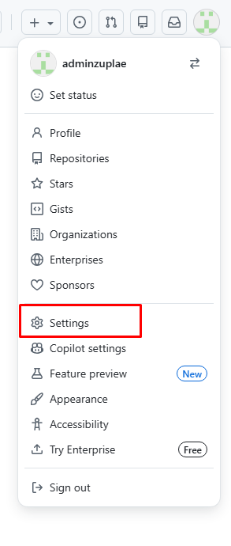
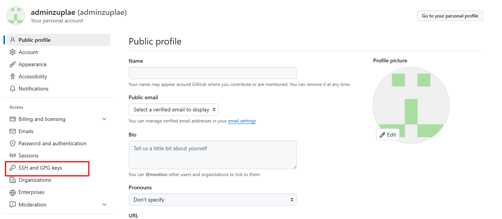
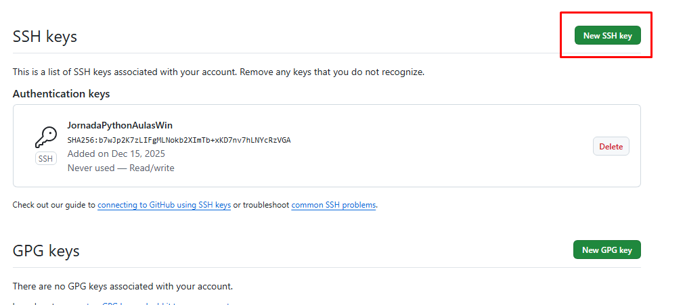
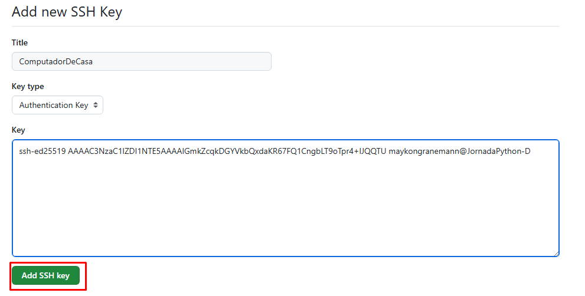

# Modulo 004 - Git & GitHub
## Configuracoes iniciais

Este documento descreve os passos iniciais para configurar o ambiente Git com autenticacao segura via SSH e identidade do usuário

---

## 1. O que e a chave SSH

A chave SSH é uma forma segura de autenticacao baseada em criptografia
Ela substitui o uso de usuário e senha

Nunca compartilhe a chave privada

---

## 2. Criando a chave SSH

Abra o **Gih Bash**  e execute: 

```bash
ssh-keygen
```
apenas precione a tecla **ENTER** para todas as opções até que aparece algo como:
```bash
The key's randomart image is:
+--[ED25519 256]--+
|    . .Eo.       |
|..o o+o.         |
|o=.*.oo          |
|= +.=o           |
|.. o=+. S        |
|.  .++   o       |
|   +... . =      |
|  ..*+o  = o     |
|   oBX=+. o      |
+----[SHA256]-----+
```

## 3. Configurando a chave SSH no GitHub

Pegando a chave publica:
```bash
cat < .ssh/id_ed25519.pub
```

A saída deve ser algo como:
```bash
ssh-ed25519 AAAAC3NzaC1lZDI1NTE5AAAAIGmkZcqkDGYVkbQxdaKR67FQ1CngbLT9oTpr4+IJQQTU maykongranemann@JornadaPython-D
```

Copie todo o valor retornado e salve no seu GitHub. Para salvar no github, siga so seguintes passos:

Clique no icone do seu usuario, no canto superior diretoe vá até **Settings**:


Depois na tela de configurações vá até **SSH and GPG keys**:


Agora clique no botão **New SSH key**:


No campo title, dê um nome para o seu computador onde a chave foi criada e cole a chave ssh copiada no campo Key, depois clique no botão **Add SSH key**:


**Pronto! Sua chave ssh esta configurado no GitHub**

## 4. Testando a conexão SSH no seu computador

Para testar a comunicação SSH utilizando a chave SSH configurada no GitHub, abra o **Git Bash** e execute o comando a seguir:

```bash
ssh -T git@github.com
```

O comando deve ficar parado no seguinte trecho:
```bash
The authenticity of host 'github.com (4.228.31.150)' can't be established.
ED25519 key fingerprint is: SHA256:+DiY3wvvV6TuJJhbpZisF/zLDA0zPMSvHdkr4UvCOqU
This key is not known by any other names.
Are you sure you want to continue connecting (yes/no/[fingerprint])? 
```

Agora apenas digite ***yes** e pressione **Enter**, você deve ter o seguinte resultado, com o nome do seu usuário do github após o Hi:
```bash
Warning: Permanently added 'github.com' (ED25519) to the list of known hosts.
Hi adminzuplae! You've successfully authenticated, but GitHub does not provide shell access.
```

**Pronto! Sua comunicação via ssh esta funcionado!**

## 5. Configurando a identidade do GIT

Aqui você irá configurar as informações do seu usuário para o Git saber qual seu nome e email.

Execute o comando para configurar seu nome no Git:
```bash
git config --global user.name "Meu nome"
```

Agora configure seu email
```bash
git config --global user.email "eu@email.com"
```

Para verificar as configurações, execute o seguinte comando:
```bash
git config --global --list
```

Isto deve mostrar as configurações criadas anteriormente